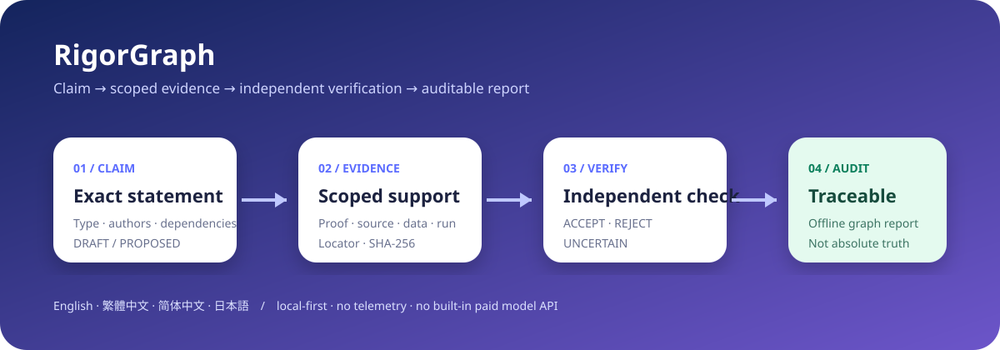

# RigorGraph

[English](README.md) · [繁體中文](README.zh-TW.md) · [简体中文](README.zh-CN.md) · [日本語](README.ja.md)

**Turn AI research into auditable claim-evidence graphs.**

RigorGraph is a local-first CLI, offline report, GitHub Action, and skill pack for recording what a research claim says, what evidence supports it, who independently checked it, and what remains open. It preserves the difference between proof, literature support, numerical evidence, benchmark evidence, and uncertainty.

> RigorGraph checks workflow integrity and traceability. `VERIFIED` means accepted by the recorded workflow; it does not mean absolute truth, formal certification, peer review, or expert consensus.

> **Public beta:** We are looking for the first five external users. Run the demo, time how long it takes to open the report, and share the first confusing step through the [beta feedback form](https://github.com/f0909172434/rigorgraph/issues/new?template=beta-feedback.yml). Do not include private research data.



## Quick start

RigorGraph requires Python 3.11 or newer. It does not require an API key. During the public beta, install the tagged source release; `pip install rigorgraph` will become available only after the approved PyPI release.

```bash
python -m pip install "git+https://github.com/f0909172434/rigorgraph.git@v0.1.0-beta.1"
rigorgraph demo --scenario math --open
```

The demo creates a project, runs a deterministic audit, and opens a self-contained report. Try the intentionally invalid promotion:

```bash
rigorgraph demo invalid-demo --scenario invalid
rigorgraph audit invalid-demo
```

The audit rejects the attempt to treat a finite numerical scan as a formal proof.

### Start your own project

```bash
rigorgraph --lang en init my-research --name "My research project"
rigorgraph audit my-research
rigorgraph report my-research --output my-report.html --open
```

The project stores human-readable, version-controlled records:

```text
my-research/
├── rigorgraph.yaml
└── .rigorgraph/
    ├── claims.jsonl
    ├── evidence.jsonl
    └── verifications.jsonl
```

## Commands

| Command | Purpose |
| --- | --- |
| `rigorgraph init` | Create a project without overwriting existing files |
| `rigorgraph claim add CLAIM.json` | Add a `DRAFT` or `PROPOSED` claim |
| `rigorgraph evidence add EVIDENCE.json` | Add scoped evidence; local files require a SHA-256 digest |
| `rigorgraph verify CLAIM_ID --file REVIEW.json` | Record an independent `ACCEPT`, `REJECT`, or `UNCERTAIN` outcome |
| `rigorgraph audit` | Check schemas, graph integrity, evidence class, independence, and hashes |
| `rigorgraph report` | Generate a four-language offline HTML report |
| `rigorgraph demo` | Create a valid math, valid benchmark, or intentionally invalid demo |

Use `--lang en`, `--lang zh-TW`, `--lang zh-CN`, or `--lang ja` before a command. Without it, RigorGraph uses project configuration, then the operating-system locale, then English.

## What the audit enforces

- IDs are unique and links resolve.
- Claim dependencies are acyclic.
- Revoked or rejected claims cannot silently support downstream claims.
- A claim author cannot be its independent verifier.
- `VERIFIED` requires an independent `ACCEPT` record.
- Formal claims need proof evidence; literature claims need an exact source locator; empirical and benchmark claims need reproducibility artifacts.
- Local evidence paths cannot escape the project and their required SHA-256 digests must match.
- An ACCEPT record is bound to the exact claim-and-evidence snapshot it reviewed.
- A verified synthesis depends only on currently verified claims.

User-authored claims, formulas, quotations, and evidence remain in their original language. The interface translates labels only.

## Agent skills and Codex plugin

The repository includes four focused [Agent Skills](skills/):

- `research-intake`
- `capture-claim`
- `adversarial-verify`
- `release-audit`

It also ships a native `.codex-plugin/plugin.json`. In Codex, ask `$skill-installer` to install skills from `f0909172434/rigorgraph`, or install the repository as a plugin through a supported local/plugin marketplace workflow.

## GitHub Action

```yaml
steps:
  - uses: actions/checkout@v6
  - uses: actions/setup-python@v6
    with:
      python-version: "3.12"
  - uses: f0909172434/rigorgraph@v0.1.0-beta.1
    with:
      path: .
      fail-on: error
```

The action writes a GitHub Job Summary and uploads the offline report. It does not post PR comments by default. The documentation will switch to `@v1` only after the stable v1 tag exists.

## Develop from source

```bash
git clone https://github.com/f0909172434/rigorgraph.git
cd rigorgraph
python -m venv .venv
python -m pip install -e ".[dev]"
cd frontend
npm install
npm run build
cd ..
pytest
python scripts/release_check.py
```

See [CONTRIBUTING.md](CONTRIBUTING.md) for translation and verification rules.

## Privacy and boundaries

- Local by default; no account, telemetry, remote database, or built-in paid model API.
- The HTML report is self-contained and makes no runtime network requests.
- Deterministic gates can catch incomplete records and invalid promotion, but cannot guarantee that a human or AI proof is mathematically correct.
- Core results still need appropriate expert review.

MIT License.
