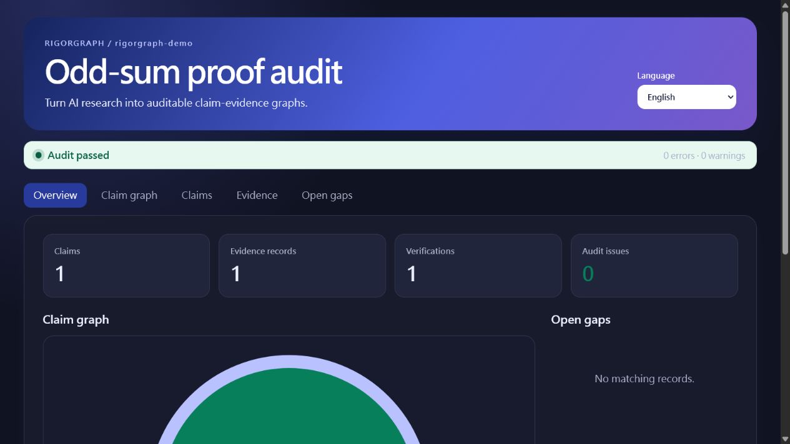

# RigorGraph

[English](README.md) · [繁體中文](README.zh-TW.md) · [简体中文](README.zh-CN.md) · [日本語](README.ja.md)

[](https://github.com/f0909172434/rigorgraph/actions/workflows/ci.yml)
[](https://github.com/f0909172434/rigorgraph/actions/workflows/codeql.yml)
[](https://pypi.org/project/rigorgraph/)
[](https://pypi.org/project/rigorgraph/)
[](LICENSE)

**Turn AI research into auditable claim-evidence graphs.**

RigorGraph is a public-beta, local-first CLI, offline report, GitHub Action, and skill pack. It records what a research claim says, what evidence supports it, who independently checked it, and what remains open while preserving the difference between proof, literature support, numerical evidence, benchmark evidence, and uncertainty.

> **Truth boundary:** RigorGraph checks workflow integrity and traceability. `VERIFIED` means accepted by the recorded workflow; it does not mean absolute truth, formal certification, peer review, or expert consensus.

> **Compatibility boundary:** The product remains in public beta. Published CLI flags and JSON output, schemas, stable audit codes, Evidence Bundle v1 fields, GitHub Action inputs and outputs, and plugin interfaces receive additive compatibility throughout 1.x. Breaking changes require a new major or schema version.

## See the result first

The bundled math demo produces this self-contained report without an account, API key, or runtime network request:



The screenshot is generated from `rigorgraph demo --scenario math`. The report keeps research text in its original language while its interface can switch between English, Traditional Chinese, Simplified Chinese, and Japanese.

## Quick start (three minutes)

RigorGraph requires Python 3.11 or newer. Install the published 1.0.1 package; the product status remains public beta.

```bash
python -m pip install "rigorgraph==1.0.1"
rigorgraph demo --scenario math --open
```

The demo creates a project, runs a deterministic audit, and opens the offline report. To see a quality gate reject an invalid promotion:

```bash
rigorgraph demo invalid-demo --scenario invalid
rigorgraph audit invalid-demo
```

The second audit rejects an attempt to treat a finite numerical scan as a formal proof.

### Start your own project

```bash
rigorgraph --lang en quickstart my-research --name "My research project" --author "Your name" --type formal --statement "Every bounded sequence has property P." --open
```

This creates one real `DRAFT` claim in the language you supplied and opens its report. The claim appears under Open gaps; RigorGraph does not invent evidence or promote it to `VERIFIED`.

```text
my-research/
├── rigorgraph.yaml
└── .rigorgraph/
    ├── claims.jsonl
    ├── evidence.jsonl
    └── verifications.jsonl
```

## When RigorGraph fits

Use RigorGraph when you need to:

- keep a version-controlled map from claims to scoped proof, literature, computation, data, or benchmark evidence;
- require an independent review record before a workflow marks a claim `VERIFIED`;
- make incomplete links, changed evidence bytes, stale reviews, and invalid status promotion fail deterministically;
- generate a read-only report that can be inspected offline or uploaded by CI;
- preserve a versioned HonestCI result as Evidence Bundle v1 without turning the result into a truth claim.

RigorGraph is not a good fit when you need:

- a theorem prover, proof assistant kernel, peer-review service, or guarantee that a claim is correct;
- a hosted collaborative database, editable web application, telemetry dashboard, or built-in model provider;
- a secrets vault or a safe place to publish private research records;
- a malware sandbox or permission boundary for hostile code and files.

## Commands

| Command | Purpose |
| --- | --- |
| `rigorgraph quickstart` | Create a first `DRAFT` claim and readable offline report without fabricating evidence |
| `rigorgraph init` | Create a project without overwriting existing files |
| `rigorgraph claim add CLAIM.json` | Add a `DRAFT` or `PROPOSED` claim |
| `rigorgraph evidence add EVIDENCE.json` | Add scoped evidence; local files require a SHA-256 digest |
| `rigorgraph evidence import BUNDLE.json` | Validate and preserve a versioned evidence bundle; optionally link it to a draft claim |
| `rigorgraph verify CLAIM_ID --file REVIEW.json` | Record an independent `ACCEPT`, `REJECT`, or `UNCERTAIN` outcome |
| `rigorgraph audit` | Check schemas, graph integrity, evidence class, independence, and hashes |
| `rigorgraph report` | Generate a four-language offline HTML report |
| `rigorgraph demo` | Create a valid math, valid benchmark, or intentionally invalid demo |

Use `--lang en`, `--lang zh-TW`, `--lang zh-CN`, or `--lang ja` before a command. Without it, RigorGraph uses project configuration, then the operating-system locale, then English.

## What the audit enforces

- IDs are unique and links resolve.
- Claim dependencies are acyclic.
- Revoked or rejected claims cannot silently support downstream claims.
- A claim author cannot be its independent verifier.
- `VERIFIED` requires an independent `ACCEPT` record.
- Formal claims need proof evidence; literature claims need an exact source locator; empirical and benchmark claims need reproducibility artifacts.
- Local evidence paths cannot escape the project and their required SHA-256 digests must match.
- An `ACCEPT` record is bound to the exact claim-and-evidence snapshot it reviewed.
- A verified synthesis depends only on currently verified claims.

User-authored claims, formulas, quotations, and evidence remain in their original language. The interface translates labels only.

## Evidence bundles and interoperability

RigorGraph 1.0 implements the additive, versioned Evidence Bundle v1 contract. An HonestCI run can emit a bundle containing result summaries, allowlisted GitHub provenance, and SHA-256 digests for its configuration and observed artifacts. Importing a bundle preserves the exact JSON in `.rigorgraph/artifacts/`; it never promotes or verifies a claim.

```bash
rigorgraph evidence import honest-ci-evidence.json --claim CLM-CI --path my-research
```

Only `DRAFT` and `PROPOSED` claims can be linked. See [Evidence bundles](docs/EVIDENCE_BUNDLES.md) for the schema, compatibility policy, privacy boundary, and HonestCI profile.

RigorGraph does not currently import, export, or claim compatibility with RO-Crate or other external research-object packaging standards. Supporting one would require an explicit field mapping, trust-boundary review, fixtures, and a versioned compatibility policy; it is not part of the current 1.x contract.

## Agent skills and Codex plugin

The repository includes four focused [Agent Skills](skills/):

- `research-intake`
- `capture-claim`
- `adversarial-verify`
- `release-audit`

It also ships a native `.codex-plugin/plugin.json`. The GitHub Release includes `rigorgraph-codex-plugin-1.0.1.zip`; extract it, then install its isolated marketplace:

```console
codex plugin marketplace add PATH_TO_EXTRACTED_BUNDLE
codex plugin add rigorgraph@rigorgraph-release
```

Start a new Codex task after installation so the four skills are discovered. See [Codex plugin installation](docs/CODEX_PLUGIN.md). The ZIP does not edit your personal marketplace file.

## GitHub Action

Pin third-party actions to full commit SHAs and pin RigorGraph to an immutable release tag:

```yaml
steps:
  - uses: actions/checkout@3d3c42e5aac5ba805825da76410c181273ba90b1 # v7
  - uses: actions/setup-python@5fda3b95a4ea91299a34e894583c3862153e4b97 # v7
    with:
      python-version: "3.12"
  - uses: f0909172434/rigorgraph@v1.0.1
    with:
      path: .
      fail-on: error
```

The action writes a GitHub Job Summary and uploads the offline report. It does not post PR comments by default. Use immutable `@v1.0.1` for reproducibility; the moving `@v1` tag follows the latest compatible 1.x release.

## Develop from source

```bash
git clone https://github.com/f0909172434/rigorgraph.git
cd rigorgraph
python -m venv .venv
python -m pip install -e ".[dev]"
cd frontend
npm ci
npm run build
cd ..
python -m pytest
python scripts/release_check.py --full
```

## Security, privacy, and documentation

- Local by default; no account, telemetry, remote database, or built-in paid model API.
- The HTML report is self-contained and makes no runtime network requests, but it embeds project content and must be reviewed before sharing.
- Deterministic gates can catch incomplete records and invalid promotion, but cannot guarantee that a human or AI proof is mathematically correct.
- Core results still need appropriate expert review.

Read the [security policy](SECURITY.md), [threat model](docs/THREAT_MODEL.md), [contribution guide](CONTRIBUTING.md), [release policy](docs/RELEASE_POLICY.md), [public-beta policy](docs/BETA_POLICY.md), and [glossary](docs/GLOSSARY.md).

MIT License. Maintained by Wang Chih Kai.
