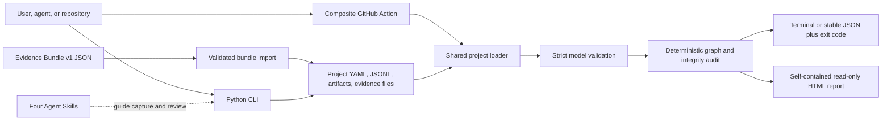

# Technical architecture

RigorGraph is a local Python application with a generated, read-only HTML viewer and a composite GitHub Action. The CLI and Action share one loader, data model, audit engine, and report generator; the Agent Skills are workflow guidance around those surfaces, not a second execution or truth system.

## Runtime surfaces

| Surface | Implementation | Responsibility |
| --- | --- | --- |
| CLI | `src/rigorgraph/cli.py` | Initialize, capture records, import bundles, record review decisions, audit, and report |
| Core models | `src/rigorgraph/models.py` | Validate versions, identifiers, enums, evidence location, and wire contracts |
| Storage | `src/rigorgraph/storage.py` | Load YAML/JSONL, contain state paths, serialize writes, and replace files atomically |
| Integrity | `src/rigorgraph/integrity.py` | Hash local evidence bytes and canonical claim-evidence review snapshots |
| Audit engine | `src/rigorgraph/audit.py` | Evaluate graph links, evidence files, review history, promotion rules, and failure status |
| Report generator | `src/rigorgraph/report.py` | Embed validated data and locales into the bundled viewer and write one HTML file |
| Frontend source | `frontend/` | Build the generated `src/rigorgraph/viewer/index.html`; the generated file ships in the wheel |
| GitHub Action | `action.yml`, `scripts/action_runner.py` | Run the shared audit in CI, write a summary and outputs, and upload the report |
| Plugin and skills | `.codex-plugin/plugin.json`, `skills/` | Provide four skills; no MCP server, app, hook, authentication flow, or model provider |

## Project format

`rigorgraph.yaml` is a strict version-1 project configuration:

| Field | Meaning |
| --- | --- |
| `version` | Must be `1` |
| `name` | Human-readable project name |
| `language` | Preferred report/CLI interface language when no explicit CLI override is supplied |
| `fail_on` | Default process threshold: `error`, `warning`, or `never` |

The three JSONL files contain one JSON object per non-empty line. Core records reject unknown fields.

### Claim

| Field group | Semantics |
| --- | --- |
| Identity | Stable `id` plus original-language `statement` |
| Classification | `formal`, `literature`, `empirical`, `benchmark`, or `synthesis` |
| Lifecycle | `DRAFT`, `PROPOSED`, `UNDER_REVIEW`, `VERIFIED`, `REJECTED`, `UNCERTAIN`, `REVOKED`, or `SUPERSEDED` |
| Graph edges | `dependencies` point to other claims; `evidence_ids` point to evidence records |
| Attribution | One or more author strings |
| History metadata | Creation/update timestamps and optional `supersedes` target |

The audit requires every graph edge to resolve, rejects dependency cycles, prevents rejected or revoked dependencies from supporting another claim, and requires every dependency of a `VERIFIED` claim to also be currently `VERIFIED`.

### Evidence

| Field group | Semantics |
| --- | --- |
| Identity and class | Stable `id`; `proof`, `source`, `dataset`, `computation`, `benchmark_run`, or `human_review` |
| Description | `title`, `producer`, and a mandatory bounded `scope` |
| Local location | `path` plus required SHA-256 digest |
| Remote location | Absolute `http`, `https`, or `doi:` URI plus required exact `locator` |
| Extension data | Optional `metadata` object; core evidence records remain strict at the top level |

Exactly one of local `path` or remote `uri` is required. Local paths are resolved against the project root during audit. Remote references are syntactically validated but not fetched, archived, or authenticated.

### Verification

A verification record contains an ID, target claim, reviewer name, `ACCEPT`/`REJECT`/`UNCERTAIN` outcome, rationale, explicitly checked evidence IDs, previous and resulting status, snapshot digest, and timestamp.

The CLI appends this record and rewrites the claim status while holding one project lock. It accepts only `PROPOSED` or `UNDER_REVIEW` claims and maps outcomes to `VERIFIED`, `REJECTED`, or `UNCERTAIN`. The audit independently checks the stored history, current status, evidence coverage, reviewer-name inequality, and snapshot. The two file replacements are serialized but are not one database transaction; version-control backups remain important if a process or machine fails between them.

The reviewer name is not a signature or account identity. RigorGraph can detect an exact name reused from `authors`; it cannot determine whether two different strings represent the same person or whether the stated reviewer performed the review.

## Evidence requirements

For an accepted claim to audit as `VERIFIED`, both the claim links and the accepted review's `checked_evidence_ids` must cover:

| Claim type | Required evidence |
| --- | --- |
| `formal` | `proof` |
| `literature` | `source`; source records require a scoped remote locator |
| `empirical` | `dataset` and `computation` |
| `benchmark` | `dataset` and `benchmark_run` |
| `synthesis` | no direct evidence class, but at least one dependency and all dependencies currently `VERIFIED` |

These are type and traceability rules. The audit does not parse a proof, rank a publication, rerun a computation, assess a dataset, or decide whether a benchmark generalizes.

## Audit pipeline and stable findings

For a successfully loaded project, the audit runs these stages:

1. Find duplicate claim, evidence, and verification IDs.
2. Resolve claim dependencies, evidence links, supersession links, and cycles.
3. Resolve local evidence paths inside the project, read bytes, and compare SHA-256 digests.
4. Re-validate preserved Evidence Bundle bytes against their derived evidence record.
5. Check review targets, reviewer-name independence, outcome/status consistency, checked evidence links, and history ordering.
6. For `VERIFIED` claims, require a latest independent `ACCEPT`, a matching snapshot, required evidence classes, and valid synthesis dependencies.
7. Return counts, ordered issues, `PASS` or `FAIL`, and a caller-controlled exit code.

Important stable issue codes include:

| Code | Meaning |
| --- | --- |
| `RG_DEPENDENCY_MISSING` / `RG_DEPENDENCY_CYCLE` | The claim graph is incomplete or cyclic |
| `RG_EVIDENCE_FILE_MISSING` / `RG_PATH_ESCAPE` | Local evidence cannot be safely resolved |
| `RG_HASH_MISMATCH` | Current local bytes differ from the evidence record |
| `RG_SELF_VERIFICATION` | The recorded verifier name matches a claim author |
| `RG_ACCEPT_MISSING` | `VERIFIED` lacks a qualifying latest acceptance |
| `RG_EVIDENCE_TYPE_MISSING` | The claim lacks a required evidence class |
| `RG_ACCEPT_EVIDENCE_UNCHECKED` | The accepting review did not list required evidence |
| `RG_SNAPSHOT_MISMATCH` | The accepted claim-evidence metadata changed after review |
| `RG_BUNDLE_INVALID` / `RG_BUNDLE_RECORD_MISMATCH` | Preserved bundle bytes or their derived record no longer satisfy the contract |

Malformed configuration or JSONL is a load error rather than an audit result. The CLI reports a stable load code such as `RG_CONFIG_MISSING`, `RG_CONFIG_INVALID`, `RG_FILE_MISSING`, `RG_RECORD_INVALID`, or `RG_PATH_UNSAFE` and exits with code 2.

## Hash semantics

RigorGraph uses two separate SHA-256 bindings:

1. **Local file digest.** `sha256_file` streams the referenced bytes in 1 MiB chunks. The recorded digest detects later byte changes.
2. **Accepted review snapshot.** `claim_snapshot_sha256` canonicalizes JSON with sorted keys and compact separators. It includes the claim content and linked evidence records sorted by evidence ID. Claim status and record timestamps are excluded; substantive fields such as statement, type, authors, dependencies, evidence links, scope, location, producer, and recorded evidence digest remain bound.

The snapshot binds what the review record says was accepted. It does not include the contents of remote resources, authenticate local authorship, or turn SHA-256 into a semantic correctness check. Local file contents are protected separately by their recorded file digests.

## Write and path behavior

- Project configuration, `.rigorgraph/`, state files, and report destinations reject unsafe symbolic links or reparse points at their relevant boundaries. Imported bundle destinations reject symbolic links and must resolve within the project.
- Existing-project record mutations acquire `.rigorgraph/.lock` with exclusive creation and a five-second default timeout. Initial project creation is non-overwriting but does not use this lock.
- JSONL rewrites and binary bundle writes use a temporary file in the destination directory, flush and `fsync`, then `os.replace`.
- Bundle import attempts to roll back artifact and record changes if a later write in the import operation fails.
- These controls reduce partial-write and path-confusion risk; they are not a transactional database or a defense against a compromised operating system. Network filesystems and abrupt machine failure may have weaker behavior.

## Offline report

The report generator loads the viewer bundled in the installed Python package and replaces one data marker with escaped JSON containing:

- project name and root directory name;
- claims, evidence, and verification records;
- the complete audit result;
- all four locale catalogs and the chosen default language.

It escapes `&`, `<`, `>`, and JavaScript line-separator characters before embedding. The generated viewer has no required runtime network request and is read-only, but the resulting HTML is a complete disclosure of the embedded project data to anyone who receives it.

Report generation is allowed for failed audits so a user or CI run can inspect the findings. A report is not a signed artifact unless the surrounding release or repository process adds and verifies a separate signature or attestation.

## GitHub Action behavior

The composite action installs RigorGraph from the checked-out action directory, not from an unpinned registry version. Its runner:

1. constrains the report input to one relative literal `.html` filename inside the selected project;
2. loads and audits the selected project;
3. generates the report before applying the configured failure threshold;
4. writes a Job Summary and multiline-safe `report` and `status` outputs; and
5. uploads the report in an `always()` step.

The action inherits the caller's runner, checkout, and permissions. It does not authenticate claims, post comments, fetch remote evidence, or sandbox hostile repository content.

## Evidence Bundle v1 boundary

The current bundle consumer recognizes the `honest-ci/check-result-v1` profile. It requires computation evidence, an `honest-ci` SemVer producer, at least one unique relative artifact descriptor, and a version-1 HonestCI result.

Bundle wire models allow unknown optional fields so 1.x producers can extend the contract additively. Import preserves the exact JSON bytes under `.rigorgraph/artifacts/` and creates a derived local evidence record. Re-importing identical content is idempotent; an ID collision with different content fails. Optional claim linking is limited to `DRAFT` and `PROPOSED` and never changes status.

See [Evidence Bundle v1](EVIDENCE_BUNDLES.md) for the profile contract and privacy boundary.

## Trust matrix

| Property | Checked | Not checked |
| --- | --- | --- |
| Record syntax | Required fields, enum values, IDs, versions, Unicode validity | Whether prose is honest or meaningful |
| Graph integrity | Link resolution, cycles, dependency status, latest review status | Whether dependencies logically entail a claim |
| Local evidence | Project containment, file availability, SHA-256 equality | Safety, authorship, semantic quality, or correctness |
| Remote evidence | URI shape and exact locator presence | Availability, current bytes, publisher identity, or credibility |
| Reviewer record | Name differs exactly from author strings; required evidence was listed | Real-world identity, competence, independence, or actual inspection |
| `VERIFIED` | Recorded acceptance, evidence classes, snapshot, and dependencies satisfy the workflow | Mathematical truth, peer review, formal certification, or expert consensus |
| Report | Validated data is escaped and embedded without required runtime network access | Confidentiality after sharing or cryptographic authenticity |
| Agent Skills | Instructions preserve the intended evidence boundary | Model correctness, compliance, or authorization to approve a claim |

## Deliberate v1 limitations

- no hosted database, multi-user synchronization, account system, or editable web UI;
- no built-in model calls, paid provider integration, MCP server, telemetry, or remote evidence retrieval;
- no cryptographic reviewer identities or signatures;
- no formal-proof adapter, proof-kernel invocation, source archive, experiment runner, or benchmark executor;
- no dedicated CLI command to update an existing draft into `PROPOSED`;
- no hardened parsing sandbox or resource quota for hostile, very large input;
- no claimed RO-Crate or other research-object packaging interoperability.

These limits are part of the current trust boundary, not implied future commitments. Candidate expansion belongs in a versioned design with fixtures, migration behavior, and explicit compatibility and security review.
