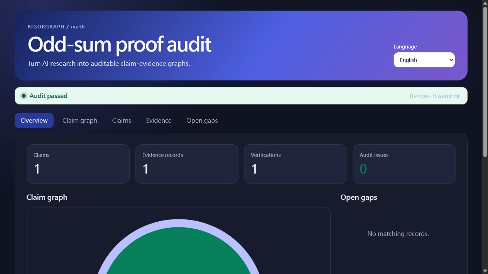
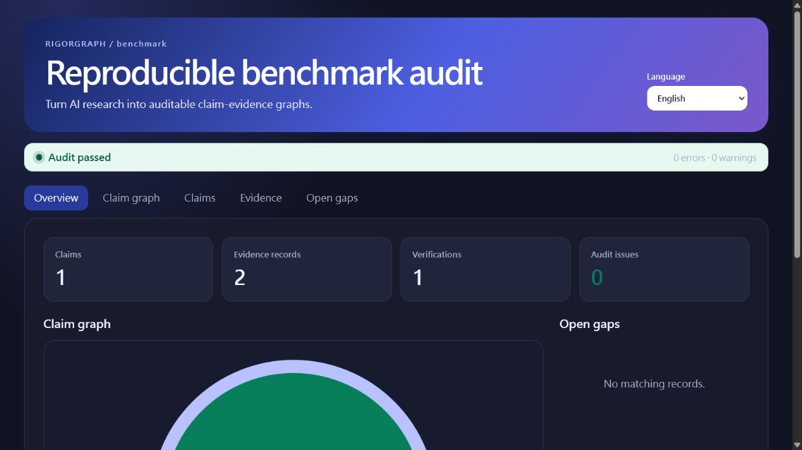
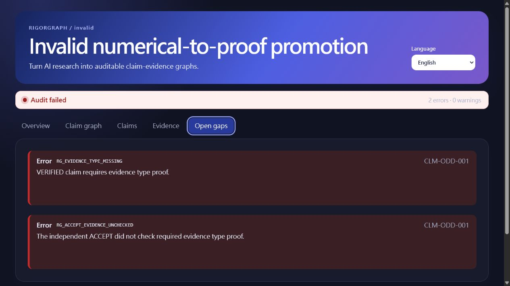

# Demo screenshot provenance

All screenshots were captured on 2026-07-28 from reports produced by a fresh installation of `v0.1.0-beta.1`, resolved to tag commit `cce3a7242c6cef359b2724ad65a361f12406a0bd`. They are product screenshots, not mockups or generated testimonials.

## Math proof workflow

- File: `launch/assets/math-report.png`
- SHA-256: `7b8b8a9d09aa9bec3f5bac6a273c5f45ff969ebc94b30b65eb3874a11008d55b`
- Shows: one formal claim, one proof record, one independent verification, zero audit issues

## Reproducible benchmark workflow

- File: `launch/assets/benchmark-report.png`
- SHA-256: `92af964e76f5953f3cb1b6d3092f596ca7d5864c69f41744c181fe0a3dad6bd9`
- Shows: one benchmark claim, two evidence records, one verification, zero audit issues

## Invalid numerical-to-proof promotion

- File: `launch/assets/invalid-promotion-report.png`
- SHA-256: `b1cd88cb0896ff2a44b933d57023d9986e21718afe8a822304197d6929e2e137`
- Shows: the exact two audit errors that reject a finite numerical scan as proof

These images document the tagged product behavior. Re-capture them after any release that changes the viewer or demo records.
